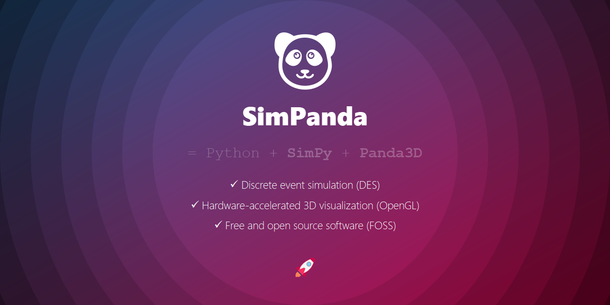

# simpanda



This project contains **boilerplate code** for combined **discrete event simulation (DES)** and **hardware-accelerated 3D visualization** with ...

- the **Python** programming language,
- the **SimPy** discrete event simulation library, and
- the **Panda3D** visulization framework.

We use the boilerplate code at the [School of Engineering](https://fh-ooe.at/campus-wels) of the [University of Applied Sciences Upper Austria](https://fh-ooe.at/) in courses on **computer simulation** and **digital factory**.

## 🧑‍💻 Examples

The following example shows how to use the `simpanda` package for building discrete event simulations with 3D visualizations:

```python
from simpanda import Container
from simpanda import cubeNodePath

# Create container including simulation environment and visualization window
container = Container(sim_time_to_real_time_ratio=1)

# Create cube geometry and attach it to visualization window
cubeNodePath().reparentTo(container.app.render)

# Start simulation and visualization threads
container.run(sim_time_duration=10)
```

## 🖼️ Screenshots

The following screenshot shows a sample output of the `simpanda` discrete event simulation and 3D visualization package:


## ⚙️ Requirements

Before getting startet with `simpanda`, you need to install **SimPy** and **Panda3D** into your local Python environment using `pip`.

### Install SimPy

*SimPy* provides **discrete event simulation capabilities** for Python programs. Here is the bash command for installing SimPy into your local Python environment:

```sh
pip install simpy
```

### Install Panda3D

*Panda3D* provides ***hardware-accelerated* 3D visualization capabilities** for Python programs. Here is the bash command for installing Panda3D into your local Python environment:

```sh
pip install panda3d
```

## 📄 Documents

Here are some more documents to read before starting to use `simpanda` for your discrete event simulation and 3D visualization projects:

* [License](./LICENSE.md)
* [Changelog](./CHANGELOG.md)
* [Contributing](./CONTRIBUTING.md)